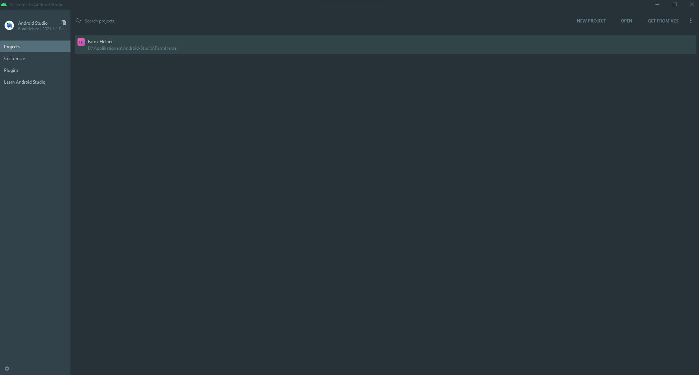

Installation Android Studio
========================================
Um mit Android Studio arbeiten zu können, musst du die Software zuerst installieren.
Den Download findest du hier:

https://developer.android.com/studio/

.. tip::
    Wenn du schon andere Jetbrains Produkte verwenden solltest, kannst du **Android Studio** einfach über die **Toolbox** installieren.
    So erhälst du automatisch Updates im Hintergrund.

Wenn du das Setup durchgeführt hast, hast du erfolgreich Android Studio installieren!

